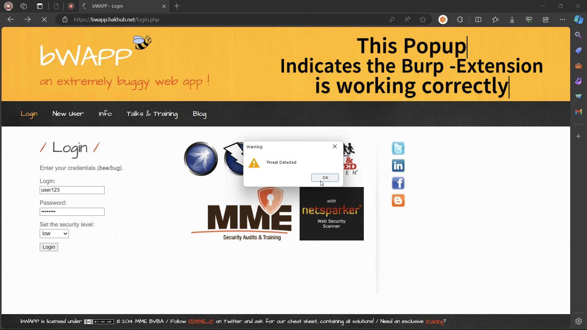
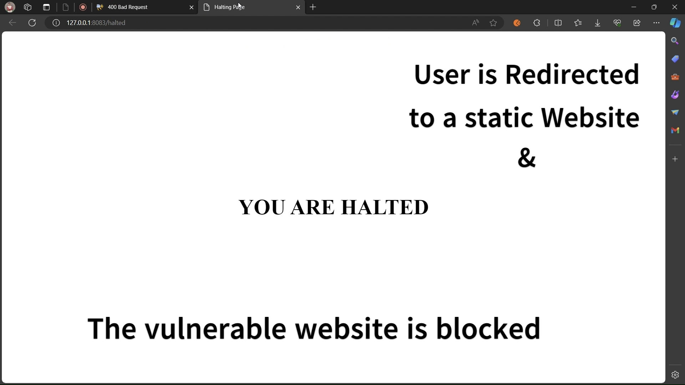
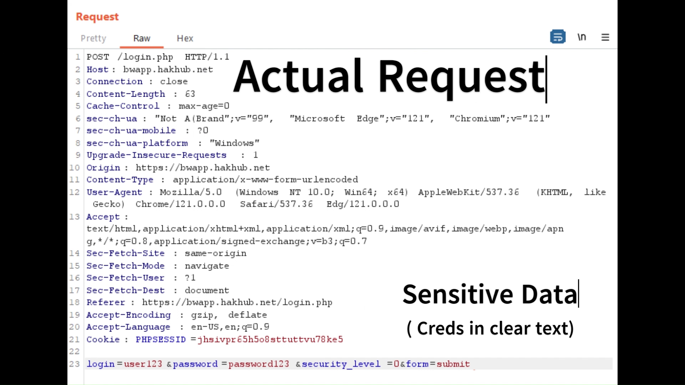

# Burpsuite-LLM-Extension

## Overview
The **Burpsuite-LLM-Extension** is a powerful integration of [Burp Suite](https://portswigger.net/burp), Python, Flask, [LangChain](https://www.langchain.com/), and the Gemini LLM. This extension is designed to enhance the security assessment process by analyzing request headers and body content in real-time. It provides alerts and recommendations based on identified vulnerabilities in request/response instances, ensuring more precise security evaluations.

## Features
- **Real-time Monitoring**: Analyzes incoming and outgoing HTTP requests and responses.
- **Vulnerability Alerts**: Detects security vulnerabilities in request headers and body content.
- **LLM Integration**: Utilizes the Gemini LLM and LangChain for intelligent pattern recognition and context-based security recommendations.
- **Customizable**: Tailored to specific security needs and easily extensible for future enhancements.

## Technologies Used
- **Burp Suite**: The core web vulnerability scanner.
- **Python**: For backend scripting and integration.
- **Flask**: A lightweight framework to create the server-side functionality.
- **LangChain**: A library to interact with LLMs.
- **Gemini LLM**: Used for deep learning-based security analysis.

## How It Works

The Burpsuite-LLM-Extension listens to HTTP traffic through Burp Suite’s interception. The Flask server communicates with the Gemini LLM through LangChain, allowing it to analyze security risks intelligently by evaluating both the request headers and body. When potential issues are identified, they are flagged, and users are alerted.

## Screenshots

### Vulnerability Alert Example

### Reason 

